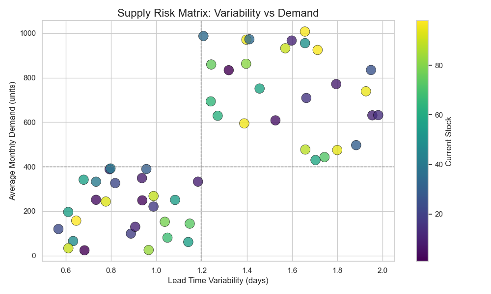

# 📦 Supply Chain Analysis: Inventory Optimization & Demand Forecasting


📌 _Sample output: Supply Risk Matrix identifying critical SKUs at risk of stockouts or overstocking._

&nbsp;

This folder contains Python scripts and models created to optimize inventory levels and forecast demand for a Fashion & Beauty startup.

Using data from [this Kaggle dataset](https://www.kaggle.com/datasets/harshsingh2209/supply-chain-analysis) I worked through several stages:
* Inventory health checks
* Demand forecasting (with synthetic data generation)
* Replenishment planning
* Bottleneck and supplier analysis

## Table of Contents

*   🙋 [Project Overview](#project-overview)
*   📝 [Scripts](#scripts)
*   🌐 [Dependencies](#dependencies)
     *   📚 [Libraries](#libraries)
*   ⏬ [Install](#install)
*   🔮 [Possible Extensions](#possible-extensions)
*   🤝 [Contribute](#contribute)
*   ©️ [License](#license)
*   🔌 [Sources](#sources)

## 🙋 Project Overview

This repository aims to showcase real-world supply chain analytics workflows, including:

* 📦 **Inventory Optimization**: Analyzing stock imbalances, calculating ideal stock levels, and optimizing reorder points to minimize carrying costs.
    * 📊 Supply Risk Matrix: Visualizes SKUs by average demand, lead time variability, and current stock to identify those most vulnerable to stockouts or overstocking.
* 🔮 **Demand Forecasting**: Generating synthetic data to model annual demand trends and predict future stock needs more accurately.
* 🔁 **Replenishment Planning**: Creating SKU-level reorder plans that account for lead times, demand variability, and service level targets.
* 🔍 **Key goal**: Demonstrate how data-driven inventory strategies can help businesses reduce stockouts, avoid overstocking, and improve fulfillment efficiency.

## 📝 Scripts

  * ```inventory_optimization.py```: Analyzes stock levels and highlights overstocked and understocked SKUs.
  * ```demand_forecasting.py```: Generates synthetic demand data and forecasts future stock needs.
  * ```replenishment_plan.py```: Calculates reorder points (ROP) and recommended reorder quantities.
  * ```synthetic_data_generation.py```: Generates a year-long synthetic dataset to support demand forecasting and inventory analysis.
  * ```bottleneck_analysis.py```: Analyzes SKUs at highest risk of supply chain disruption based on demand and fulfillment variability.
  * ```supplier_analysis.py```: Evaluates supplier performance by assessing variability and reliability of lead times across SKUs.

## 🌐 Dependencies

_Note: local dependencies for each script are specified in the script headers_
  * ### 📚 Libraries
    
    This project uses the following core Python libraries:
      * ```pandas```
      * ```numpy```
      * ```matplotlib```
      * ```seaborn```
      * ```statsmodels```
      * ```scikit-learn``` (for synthetic data generation and modeling)

    Install with pip
    ```bash
    pip install pandas numpy matplotlib seaborn scikit-learn statsmodels
    ```


## ⏬ Install

Clone this repository to your local machine and navigate to the analysis folder:

```bash
git clone https://github.com/ndcarlos/supplychain-makeup
cd supplychain-makeup/supply_chain_analysis
```

Run scripts like:

```bash
python inventory_optimization.py
```


## 🔮 Possible Extensions
* Build interactive dashboards using Streamlit or Plotly
* Integrate external supplier APIs to enrich lead time data
* Apply clustering to segment SKUs by fulfillment behavior


## 🤝 Contribute

Pull requests are welcome! Open an issue first to discuss major changes.

## ©️ License

[MIT](https://choosealicense.com/licenses/mit/)

## 🔌 Sources

[react-markdown][react-markdown] - Project which served as an inspiration for this README

[Blog post templates][blog-post-templates] - Used to structure this template as an easy-to-read blog post

[About markdown][about-markdown] - Why should you use markdown?

[Markdown Cheat Sheet][markdown-cheatsheet] - Get a fast overview of the syntax

[//]: # "Source definitions"
[blog-post-templates]: https://backlinko.com/hub/content/blog-post-templates "Backlinko blog post templates"
[about-markdown]: https://www.markdownguide.org/getting-started/ "Introduction to markdown"
[markdown-cheatsheet]: https://www.markdownguide.org/cheat-sheet/ "Markdown Cheat Sheet"
